<!-- 

  🇵🇹

<h2 align="center">Sou o Paulo, neste momento estou a frequentar o mestrado em Engenharia Informática na Universidade do Minho</h2>

<h3 align="center">Sobre min</h3>

<h4 align="center">Gosto de ir à praia, ouvir música, ler ocasionalmente, viajar e ir ao ginásio</h4>

<h3 align="left">➡️ <a href="https://github.com/PaulAlv99/PersonalProjects">Projetos Pessoais</a></h3> -->

<!-- <h3 align="left">➡️ <a href="https://github.com/PaulAlv99/Universidade">Projetos Universidade</a></h3> -->

<!-- 

  

 -->
<!-- 
 -->

<!-- 

  🇬🇧

 -->
<h2 align="center">I am Paulo, a Master’s student in Computer Science and Engineering at the University of Minho.</h2>

<h3 align="center">About me</h3>

<h4 align="center">I enjoy going to the beach, listening to music, reading, travelling, and working out. These are just a few of my interests. Feel free to contact me to know more.</h4>

<h3 align="left">➡️ <a href="https://github.com/PaulAlv99/PersonalProjects">Personal Projects</a></h3>

<!-- 

  <!-- 
     -->
  

 -->
<!-- 
 -->
<!-- <h3 align="left">➡️ <a href="https://github.com/PaulAlv99/Universidade">University Projects</a></h3> -->
<!-- 

  

 -->

<!-- 

  

 -->

<!-- 

  

 -->

